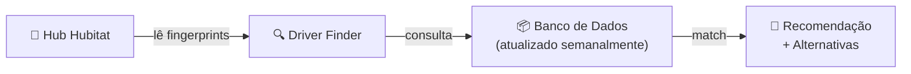

# Hubitat Driver Finder v2.5.0

> Encontre o driver ideal para todos os seus dispositivos Zigbee e Z-Wave no Hubitat — sem pesquisar manualmente em fóruns.

---

## O que é?

O **Hubitat Driver Finder** é um SmartApp para Hubitat Elevation que analisa automaticamente os dispositivos do seu hub e recomenda o driver mais adequado para cada um.

Ele consulta um banco de dados com **2.400+ dispositivos** catalogados, aplica um algoritmo de scoring inteligente e apresenta a recomendação com nível de confiança e alternativas.

---

## Como funciona?

1. O app lê **manufacturer**, **model** e **clusters** de cada dispositivo do hub
2. Consulta um banco de dados remoto atualizado semanalmente via CI/CD
3. Aplica um algoritmo de scoring que avalia fingerprint, clusters, fonte de dados e disponibilidade no HPM
4. Apresenta a recomendação com **confiança** e **alternativas**

---

## Funcionalidades

### 🔎 Pesquisa Individual
Selecione qualquer dispositivo e veja:
- Driver recomendado com autor e tipo
- Badge **HPM** ou **Built-in** indicando como instalar
- Link direto para o GitHub ou página do autor
- Lista de drivers alternativos com HPM badge e links
- Score de confiança e motivo da recomendação

### 📊 Scan Completo
Análise de todos os dispositivos de uma vez. A tabela mostra:

| Coluna | Descrição |
|---|---|
| Dispositivo | Nome no hub |
| Protocolo | Zigbee ou Z-Wave |
| Driver Atual | O que está em uso |
| Recomendado | Sugestão do app + `+N outros` alternativas |
| HPM / Link | Disponibilidade e acesso rápido |
| Confiança | ⭐ a ⭐⭐⭐ |
| Status | Classificação visual |

### 🏷️ Classificação em 4 Estados

| Status | Ícone | Significado |
|---|---|---|
| **Ideal** | ✅ | Você já está usando o driver recomendado |
| **Compatível** | 🔵 | Seu driver funciona, é uma alternativa conhecida |
| **Sugestão** | 🟡 | Existem drivers melhores disponíveis |
| **Não encontrado** | 🔴 | Dispositivo ainda não catalogado |

> A categoria **Compatível** elimina falsos alarmes — você sabe que seu driver está funcionando, mesmo não sendo o #1 recomendado.

### 📈 Estatísticas
Painel com resumo geral do hub: quantos dispositivos estão com driver ideal, compatível, com sugestão ou sem recomendação.

---

## Instalação

1. No Hubitat, acesse **Apps Code**
2. Clique em **New App**
3. Cole o conteúdo de [`src/HubitatDriverFinder.groovy`](src/HubitatDriverFinder.groovy)
4. Clique em **Save**
5. Acesse **Apps** → **Add User App**
6. Selecione **Hubitat Driver Finder**
7. Toque em **Select All** para dar acesso a todos os dispositivos
8. Pronto! Navegue entre pesquisa individual e scan completo

---

## Destaques

| | |
|---|---|
| 📡 **Multi-protocolo** | Zigbee e Z-Wave no mesmo app |
| 🧠 **Matching inteligente** | Reconhece variações de nomes como `(dev)`, `(beta)`, `v2` |
| 📦 **2.400+ dispositivos** | Banco de dados com 12 fontes integradas |
| ⚡ **Cache 24h** | Sem downloads repetidos — rápido e eficiente |
| 🔄 **Atualização automática** | CI/CD semanal mantém o banco sempre atual |
| 🆓 **Zero manutenção** | Instale uma vez, funciona sozinho |

---

## Sobre o cache de 24h

Quando o app mostra que o cache expira em algumas horas, ele está reutilizando a lista de drivers que já baixou. Isso evita downloads repetidos e deixa tudo mais rápido.

Quando o tempo acabar, ele baixa uma lista atualizada automaticamente na próxima consulta. Você também pode forçar a atualização pelo botão **🔄 Baixar Database Novamente** no menu principal.

---

## Tipos de Recomendação

O app pode retornar diferentes tipos de match:

- **Match exato** ⭐⭐⭐ — Fingerprint encontrada no banco de dados
- **Match parcial** ⭐⭐ — Mesmo fabricante, modelo similar
- **Recomendação por fabricante** ⭐ — Regra de fallback baseada no prefixo do fabricante
- **Análise por clusters** ⭐ — Sugestão Zigbee baseada nos clusters reportados
- **Sugestão Z-Wave genérica** ⭐ — Tipo aparente reconhecível, sem fingerprint exata
- **Sem recomendação** — Dispositivo ainda não mapeado

---

## Licença

MIT License.
