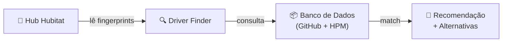
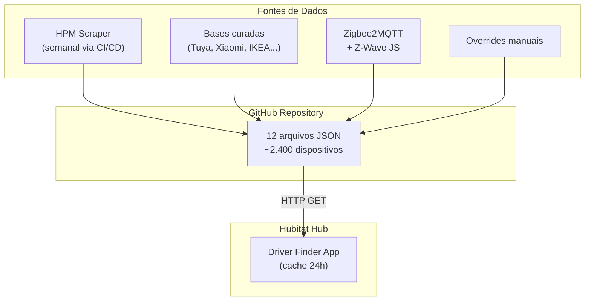

# Hubitat Driver Finder v2.5.0

> **Ferramenta inteligente de recomendação de drivers para dispositivos Zigbee e Z-Wave no Hubitat Elevation**

---

## O Problema

Usuários do Hubitat frequentemente enfrentam dificuldade para identificar qual driver usar em cada dispositivo. Com centenas de drivers disponíveis — entre built-in, comunidade e HPM — escolher o correto exige pesquisa manual no fórum, tentativa e erro, ou conhecimento técnico avançado de protocolos Zigbee/Z-Wave.

**Resultado:** dispositivos mal configurados, funcionalidades perdidas e tempo desperdiçado em suporte.

---

## A Solução

O **Driver Finder** é um SmartApp instalado diretamente no Hubitat que analisa automaticamente todos os dispositivos do hub e recomenda o driver ideal para cada um, com base em um banco de dados curado e continuamente atualizado.

---

## Como Funciona

1. O app lê o **manufacturer**, **model** e **clusters** de cada dispositivo do hub
2. Consulta um banco de dados remoto com **2.400+ dispositivos** catalogados
3. Aplica um **algoritmo de scoring** que considera fingerprint, compatibilidade de clusters, fonte de dados e disponibilidade no HPM
4. Apresenta a recomendação com **nível de confiança** e **alternativas**

---

## Funcionalidades Principais

### 🔎 Pesquisa Individual
Selecione qualquer dispositivo e receba uma análise detalhada:
- Driver recomendado com autor e tipo
- Badge de disponibilidade HPM ou Built-in
- Link direto para o GitHub/página do autor
- Lista de drivers alternativos com HPM badge e links
- Score de confiança e motivo da recomendação

### 📊 Scan Completo
Análise em lote de todos os dispositivos Zigbee e Z-Wave do hub, com tabela visual mostrando:

| Coluna | Descrição |
|---|---|
| Dispositivo | Nome no hub |
| Protocolo | Zigbee ou Z-Wave |
| Driver Atual | O que está em uso |
| Recomendado | Sugestão do app + `+N outros` |
| HPM / Link | Disponibilidade e acesso rápido |
| Confiança | ⭐ a ⭐⭐⭐ |
| Status | Classificação visual |

### 🏷️ Classificação em 4 Estados

| Status | Significado |
|---|---|
| ✅ **Ideal** | Driver atual é o melhor recomendado |
| 🔵 **Compatível** | Driver atual funciona, é uma alternativa conhecida |
| 🟡 **Sugestão** | Existem drivers melhores disponíveis |
| 🔴 **Não encontrado** | Dispositivo não catalogado no banco |

> A categoria **Compatível** elimina falsos alarmes — o usuário sabe que seu driver funciona, mesmo não sendo o #1 recomendado.

### 📈 Estatísticas
Painel com resumo do hub: total de dispositivos analisados, percentual com driver ideal, banco de dados carregado e status do cache.

---

## Diferenciais Técnicos

| Feature | Detalhe |
|---|---|
| **Multi-protocolo** | Suporta Zigbee e Z-Wave no mesmo app |
| **Matching inteligente** | Normaliza nomes de driver, ignora sufixos como `(dev)`, `(beta)`, `v2` |
| **Scoring multi-fator** | Fingerprint + clusters + fonte de dados + HPM + driver scope |
| **Cache com TTL** | Banco de dados cacheado por 24h na JVM, sem downloads repetidos |
| **Banco distribuído** | 12 arquivos JSON especializados (HPM scrape, Zigbee2MQTT, Z-Wave JS, curados manualmente) |
| **CI/CD automatizado** | GitHub Actions faz scrape semanal do HPM e atualiza o banco automaticamente |
| **Zero manutenção** | Usuário instala uma vez, o app se mantém atualizado sozinho |

---

## Arquitetura do Banco de Dados

**Prioridade de fontes** (conflitos resolvidos por score):
1. 🏆 Overrides manuais (decisões validadas)
2. 🏢 Base da empresa (dispositivos internos)
3. 📦 HPM Scraped (comunidade ativa)
4. 🌐 Zigbee2MQTT / Z-Wave JS (referência pública)

---

## Números

| Métrica | Valor |
|---|---|
| Dispositivos catalogados | **2.400+** |
| Fontes de dados integradas | **12** |
| Níveis de classificação | **4** |
| Cache inteligente | **24h** |
| Intervenção manual para atualização | **Zero** |

---

## Stack Técnico

| Componente | Tecnologia |
|---|---|
| Linguagem | Groovy (SmartApp nativo do Hubitat) |
| Banco de dados | JSON estático hospedado no GitHub |
| CI/CD | GitHub Actions (scrape semanal do HPM) |
| Distribuição | Código-fonte aberto, instalação via HPM ou import manual |
